# WeightLens

Visual comparison tool for neural network model weights — analyze quantization, pruning, distillation, and fine-tuning effects with interactive DAG navigation.

---

## Features

### 1. Main Dashboard

The landing page provides quick access to all tools. Choose between **Architecture Viewer** (single model graph) or **Weight Comparison** (multi-model analysis). The dashboard adapts to your preferred theme — dark or light — saved automatically across sessions.

<p align="center">
  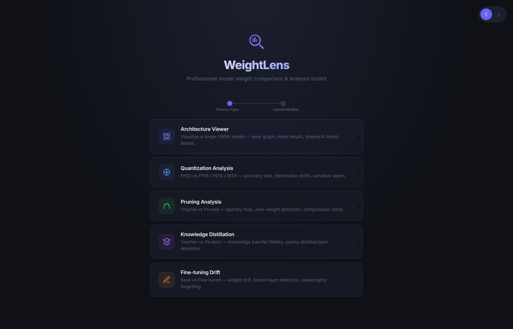
</p>
<p align="center"><em>Dark Mode</em></p>

<p align="center">
  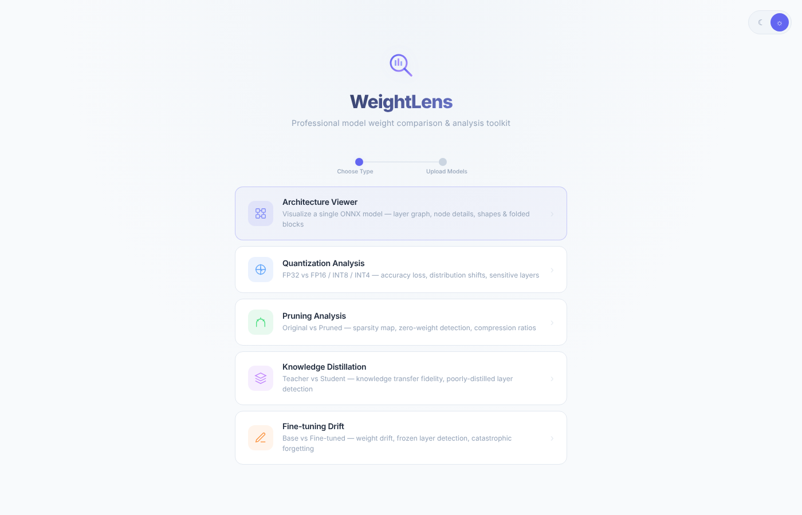
</p>
<p align="center"><em>Light Mode</em></p>

---

### 2. Architecture Viewer (Single Model Visualization)

Upload any ONNX model and instantly visualize its full computation graph as an interactive DAG. Each operation (Conv, Relu, MatMul, Softmax, etc.) is rendered as a color-coded node. Input/output tensor shapes are displayed on edges so you can trace data flow at a glance.

**How it works:** Drag and drop your `.onnx` file (or any of 50+ supported formats) onto the upload zone. WeightLens parses the model, extracts the computation graph, and renders it using an automatic hierarchical layout (dagre). Nodes are grouped by type — convolutions, activations, normalizations, attention layers — each with a distinct color for quick identification.

**What you can do:**
- Pan and zoom the entire graph to navigate large architectures
- Click any node to inspect its full properties in the sidebar
- Toggle fold/collapse options to simplify complex graphs
- Export or screenshot the rendered architecture for documentation

<p align="center">
  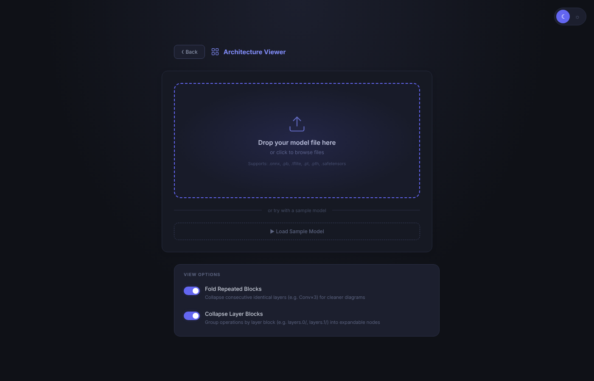
</p>
<p align="center"><em>Upload Page — drag & drop any model file</em></p>

<p align="center">
  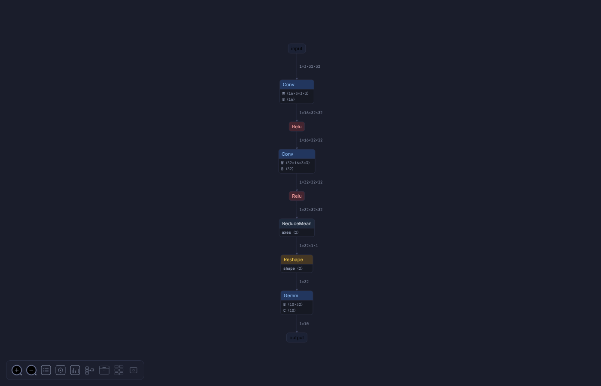
</p>
<p align="center"><em>Full Graph View — interactive DAG with color-coded operations</em></p>

---

### 3. Node Details Sidebar

Click any node in the graph to open the details sidebar. Inspect every property — operation type, input/output tensors, weight dimensions, data types, attributes, and raw values. Zoom into specific regions of the graph for precise inspection.

<p align="center">
  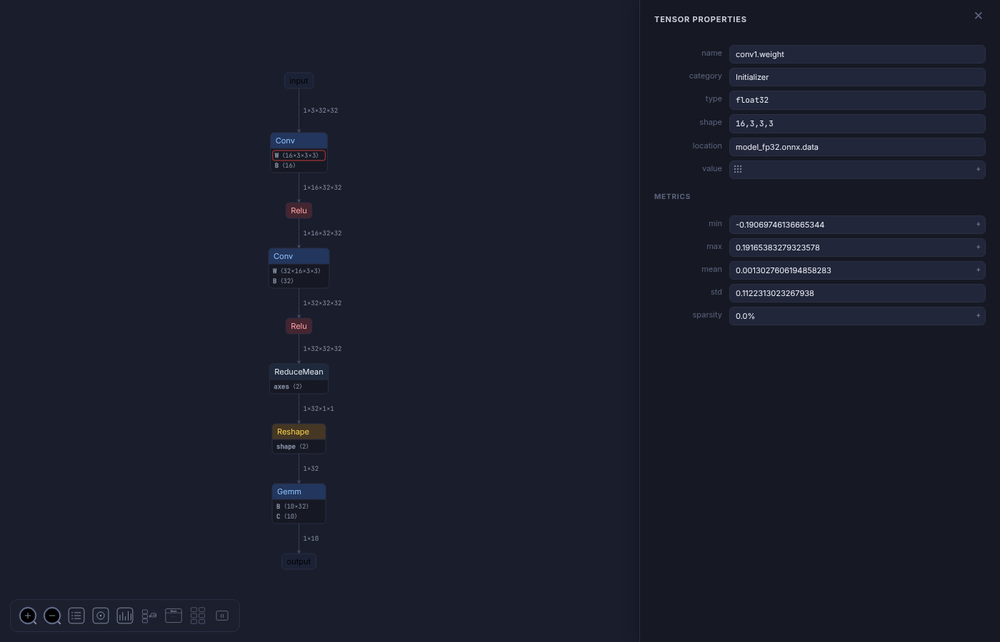
</p>
<p align="center"><em>Node Properties Panel — full tensor info, attributes, and data types</em></p>

<p align="center">
  
</p>
<p align="center"><em>Zoomed Graph Region — inspect specific layers in detail</em></p>

---

### 4. Multi-Model Weight Comparison (Quantization Analysis)

Load two or more models side-by-side to compare their weights layer-by-layer. This is the core feature of WeightLens — it answers the question: *"What exactly changed in my model's weights after quantization/pruning/fine-tuning?"*

**How it works:** Upload a baseline model (e.g. FP32) and one or more transformed models (e.g. INT8, pruned). WeightLens automatically matches corresponding layers by name, extracts weight tensors, and generates statistical comparisons for each layer. You get instant visual feedback on where your model degraded and by how much.

**Supported comparison scenarios:**
- **Quantization Analysis** — FP32 vs INT8/INT4/FP16: detect accuracy loss, clipping artifacts, and distribution shifts introduced by reduced precision
- **Pruning Analysis** — Original vs Pruned: visualize sparsity maps, zero-weight patterns, and structural changes from magnitude/structured pruning
- **Knowledge Distillation** — Teacher vs Student: measure how faithfully the student model reproduces the teacher's weight distributions
- **Fine-tuning Drift** — Base vs Fine-tuned: identify which layers drifted most, detect catastrophic forgetting by tracking weight magnitude changes

**What you see in the comparison dashboard:**
- Per-layer health score badges (green/yellow/red) on a navigable graph
- Side-by-side weight distribution charts (PDF, CDF, Q-Q, scatter, heatmap)
- Statistical distance metrics (KL divergence, Wasserstein, RMSE) for each layer
- Layer-by-layer navigation with Prev/Next controls and position indicator

<p align="center">
  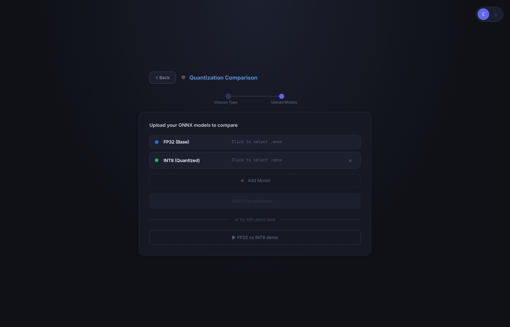
</p>
<p align="center"><em>Upload Multiple Models — select baseline and comparison variants</em></p>

<p align="center">
  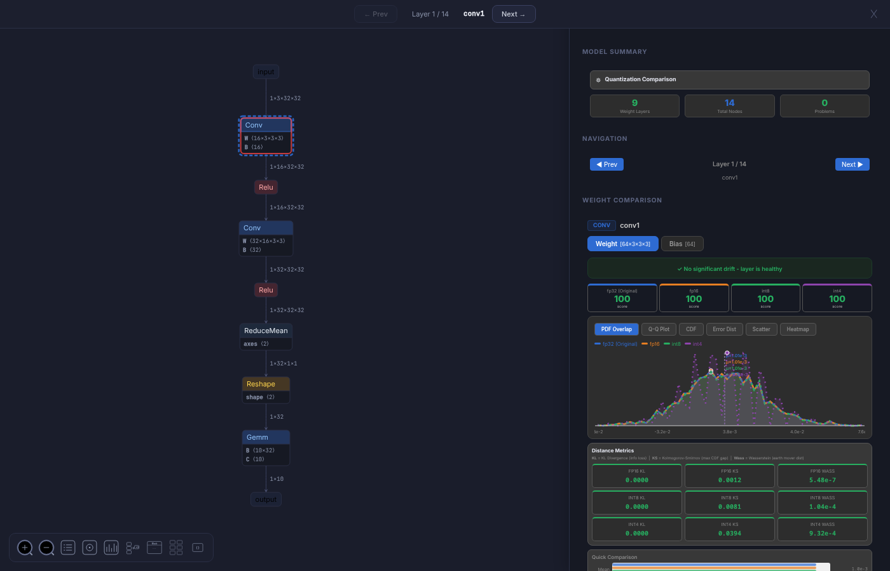
</p>
<p align="center"><em>Comparison Dashboard — charts, health scores, and distribution overlays</em></p>

<p align="center">
  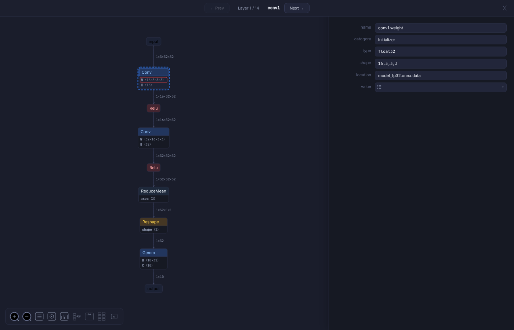
</p>
<p align="center"><em>Layer Navigation + Weight Details — per-layer deep dive</em></p>

<p align="center">
  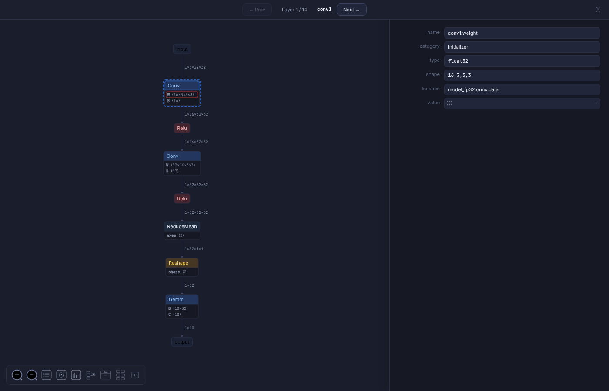
</p>
<p align="center"><em>Compare Toolbar — switch chart types, navigate layers</em></p>

---

### 5. Per-Layer Health Scores & Distance Metrics

Each weight layer gets a health score (0–100) based on statistical comparison between models. Scores are displayed as colored badges — green (healthy), yellow (warning), red (problem detected). Quantitative distances include:
- **KL Divergence** — information-theoretic measure of distribution difference
- **Kolmogorov-Smirnov** — maximum CDF deviation between distributions
- **Wasserstein (Earth Mover's)** — optimal transport distance
- **RMSE / Max Error** — absolute magnitude of weight changes

---

### 6. Six Chart Types for Weight Analysis

Visualize weight differences using multiple statistical views:
- **PDF Overlap** — probability density function comparison across all model variants
- **Q-Q Plot** — quantile-quantile plot to detect distribution shape changes
- **CDF** — cumulative distribution function for threshold analysis
- **Error Distribution** — histogram of weight differences between models
- **Scatter Plot** — point-by-point weight correlation between two models
- **Heatmap** — 2D visualization of weight matrices and their differences

---

### 7. Hierarchical Block Collapsing (Large Models)

For large models (e.g. Qwen 0.5B with 500+ nodes), the graph engine automatically groups operations by their logical block structure (e.g. `model/layers.0/self_attn`, `model/layers.1/mlp`). Each collapsed block shows the operation count inside it. Blocks can be expanded/collapsed individually or all at once — making transformer architectures with 24+ identical layers navigable.

<p align="center">
  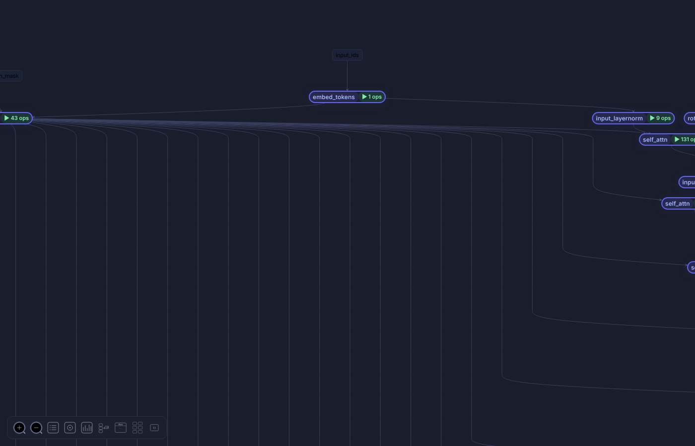
</p>
<p align="center"><em>Collapsed Blocks Overview — entire Qwen 0.5B model in one screen</em></p>

<p align="center">
  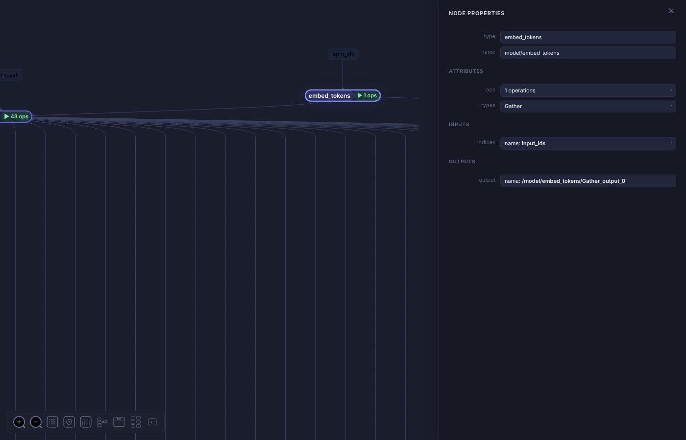
</p>
<p align="center"><em>Block Node Properties — click to see operations inside each block</em></p>

<p align="center">
  
</p>
<p align="center"><em>Collapsed Zoomed View — individual block inspection</em></p>

<p align="center">
  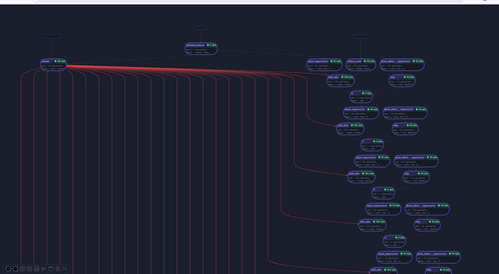
</p>
<p align="center"><em>Full Expanded Architecture — all blocks unfolded</em></p>

---

### 8. Fold Repeated Blocks

Detects consecutive identical operations in the graph (e.g. three Conv layers with the same parameters) and folds them into a single node with a multiplier badge (Conv×3). Toggle folding on/off from the Architecture Viewer to switch between compact and detailed views.

<p align="center">
  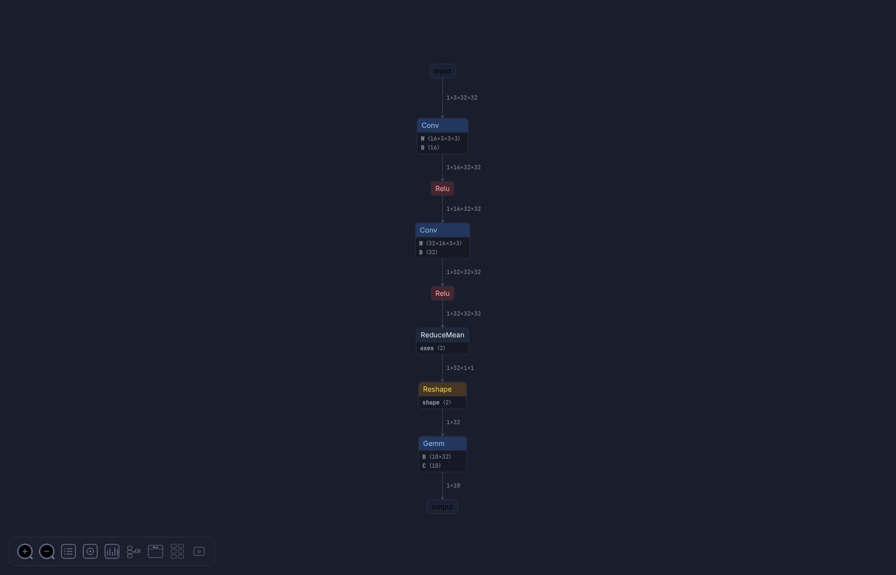
</p>
<p align="center"><em>Fold Enabled — repeated operations collapsed with multiplier badge</em></p>

<p align="center">
  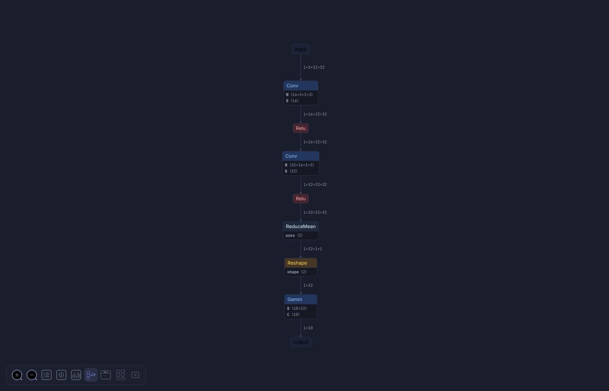
</p>
<p align="center"><em>Fold Disabled — all individual operations visible</em></p>

---

### 9. Interactive DAG Navigation

- Click any node to select it and view its properties in the sidebar
- Use **Prev/Next** buttons to walk through layers in execution order
- Layer counter shows current position (e.g. "Layer 5 / 14")
- Selected nodes are highlighted with a colored border; connected edges are emphasized

---

### 10. Layer Grouping (Weight + Bias Tabs)

For layers with multiple parameters (e.g. Conv has both weight and bias), both are shown as switchable tabs within a single comparison dashboard. No need to navigate away — compare bias vs weight behavior in one view.

---

### 11. Dark / Light Theme

Full dark and light theme support with a single-click toggle. Theme preference is persisted in localStorage. Every element adapts — graph nodes, edges, sidebar, toolbar, upload pages, and charts.

<p align="center">
  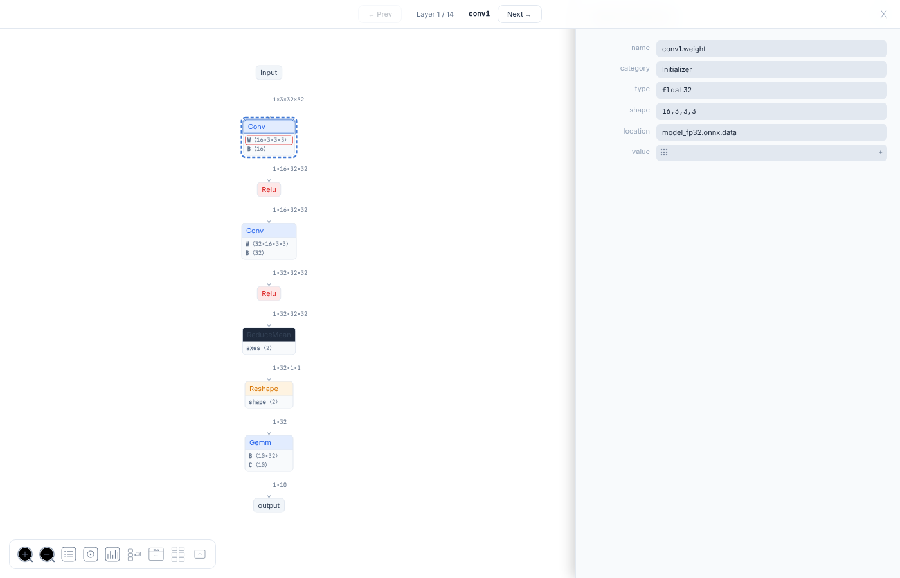
</p>
<p align="center"><em>Light Theme — full graph view with light color scheme</em></p>

---

### 12. 50+ Model Format Support

Supports ONNX, PyTorch (.pt/.pth), TensorFlow (.pb), TFLite, Keras (.h5), CoreML, SafeTensors, Caffe, MXNet, PaddlePaddle, NCNN, TensorRT, OpenVINO, RKNN, MegEngine, and more. Each format has a dedicated parser with full metadata extraction.

---

### 13. Cross-Platform Desktop App

Available as a native desktop application for macOS (.dmg), Linux (.deb, .rpm, .AppImage), and Windows (.exe). Built with Electron for native file system access and offline usage. Also runs as a zero-install browser app.

---

## Install

**Browser:** Start the [browser version](https://gaurav14cs17.github.io/WeightLens) or run locally:

```bash
python3 serve.py
# Open http://localhost:8080
```

**macOS:** Download the `.dmg` file from [Releases](https://github.com/Gaurav14cs17/WeightLens/releases) or run:

```bash
brew install --cask WeightLens
```

**Linux:** Download the `.deb` or `.rpm` file from [Releases](https://github.com/Gaurav14cs17/WeightLens/releases):

```bash
# Debian/Ubuntu
sudo dpkg -i WeightLens-1.0.0-amd64.deb

# Fedora/RHEL
sudo rpm -i WeightLens-1.0.0-x86_64.rpm

# AppImage (any distro)
chmod +x WeightLens-1.0.0-x86_64.AppImage
./WeightLens-1.0.0-x86_64.AppImage
```

**Windows:** Download the `.exe` installer from [Releases](https://github.com/Gaurav14cs17/WeightLens/releases) or run:

```bash
winget install -s winget WeightLens
```

## Build from Source

```bash
# Install dependencies
npm install

# Run in development (Electron)
npm start

# Run browser version
python3 serve.py

# Build for current platform
npm run build

# Build for specific platform
npm run build:mac
npm run build:linux
npm run build:win

# Build all platforms
npm run build:all
```

Installers will be output to the `dist/` folder.

## Project Structure

```
WeightLens/
├── .gitignore        # Git ignore rules
├── .github/          # GitHub Actions CI/CD workflows
├── package.json      # Electron app config + build scripts
├── package-lock.json # Locked dependency versions
├── index.html        # Root redirect to src/index.html
├── serve.py          # Dev server (no-cache, port 8080, serves from src/)
├── README.md         # This file
├── ARCHITECTURE.md   # Developer guide — code map, boot flow, how to extend
├── screenshots/      # Feature screenshots for documentation
├── scripts/          # Automation scripts (screenshots, builds)
└── src/              # Application source
    ├── index.html    # Entry point, welcome UI, inline CSS, theme
    ├── index.js      # Module loader + _resolve() path mapper
    ├── core/         # Main application logic (view, grapher, browser, app)
    ├── lib/          # Shared utility libraries
    ├── parsers/      # Model format parsers + metadata
    └── assets/       # Static files (favicon, icon)
```

## For Developers

See [ARCHITECTURE.md](ARCHITECTURE.md) for code structure, module system, boot sequence, and how to add features.

## License

MIT
